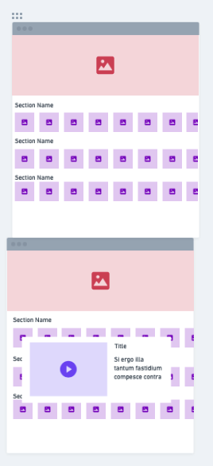

# Not Netflix

### SEV9 Group Project

## Project Description

Not Netflix is a web application that allows users to browse movies and TV shows. Users can watch trailers and read additional information about the movie or TV show.

## Team Members

- Sarah Johnson @kitteyandkat
- Marie Epps @nebulamarie
- Shawn Bailey @shawnmbailey
- Connor Hennessey @hennc94

<table style="width: 80vw; margin: 0 auto; height: 50vh; border-collapse: separate; border-spacing: 15px;">
  <tr>
    <td style="border: 2px black solid; width: 25%; height: 100%;" align="center">
      
 
        
        <h6>Sarah Johnson</h6>
      

      
    </td>
    <td style="border: 2px black solid; width: 25%; height: 100%; text-align:center;" align="center">
      
 
        
        <h6>Marie Epps</h6>
      

      
    </td>
    <td style="border: 2px black solid; width: 25%; height: 100%; text-align:center;" align="center">
      
 
        
        <h6>Shawn Bailey</h6>
      

      
    </td>
    <td style="border: 2px black solid; width: 25%; height: 100%; text-align:center;" align="center">
      
 
        
        <h6>Connor Hennessey</h6>
      

      
    </td>
  </tr>
</table>

## Project Links

- [Not Netflix](https://sev9-not-netflix.vercel.app/)

## WireFrames

## Project Screenshots

## Libraries Used
- React-player

## Code Snippets
